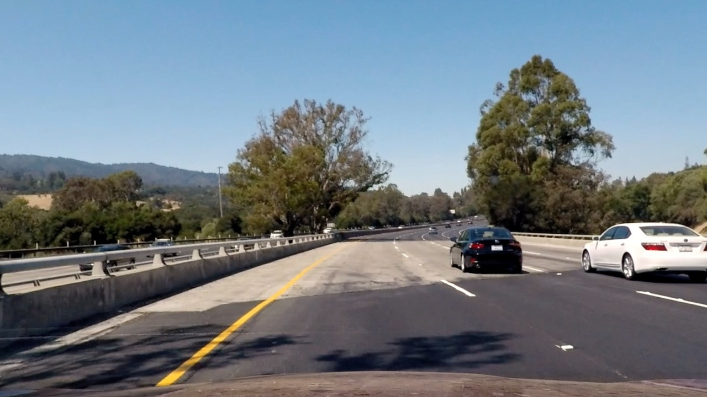

# **Advanced Lane Finding**

The goals / steps of this project are the following:

* Compute the camera calibration matrix and distortion coefficients given a set of chessboard images.
* Apply a distortion correction to raw images.
* Use color transforms, gradients, etc., to create a thresholded binary image.
* Apply a perspective transform to rectify binary image ("birds-eye view").
* Detect lane pixels and fit to find the lane boundary.
* Determine the curvature of the lane and vehicle position with respect to center.
* Warp the detected lane boundaries back onto the original image.
* Output visual display of the lane boundaries and numerical estimation of lane curvature and vehicle position.
---

#### 1. There are four python files in my submission:

`cam_cal.py` is used in camera calibration; `tracker.py` is for tracking the window search.

`image_gen.py` and `video_gen.py` are extremely similar in that they include the same functions that were being applied.

It is just of the convenience to process image and video separately.

In my writeup, I will reference my code to the lines in `image_gen.py`.
___
### Camera Calibration

#### 1. Briefly state how you computed the camera matrix and distortion coefficients. Provide an example of a distortion corrected calibration image.

The code for this step is contained in two places:
  1)in file called `cam_cal.py`
  2)in lines 9-11 and 69 of the file called `image_gen.py`).  

I start by preparing "object points", which will be the (x, y, z) coordinates of the chessboard corners in the world. Here I am assuming the chessboard is fixed on the (x, y) plane at z=0, such that the object points are the same for each calibration image.  Thus, `objp` is just a replicated array of coordinates, and `objpoints` will be appended with a copy of it every time I successfully detect all chessboard corners in a test image.  `imgpoints` will be appended with the (x, y) pixel position of each of the corners in the image plane with each successful chessboard detection.  

I then used the output `objpoints` and `imgpoints` to compute the camera calibration and distortion coefficients using the `cv2.calibrateCamera()` function.

Calibrated camera data is saved in file 'calibration_pickle.p'  

I applied this distortion correction to the test image using the `cv2.undistort()` function and obtained this result:

Original Image

Undistorted Image
___
### Pipeline (single images)

#### 1. Provide an example of a distortion-corrected image.
To demonstrate this step, I will describe how I apply the distortion correction to one of the test images like this one:

Original Image

Undistorted Image

#### 2. Describe how (and identify where in your code) you used color transforms, gradients or other methods to create a thresholded binary image.  Provide an example of a binary image result.
I used a combination of color and gradient thresholds to generate a binary image (thresholding steps at lines 13-22, 24-33, 35-43, 45-58, 73-77 in `image_gen.py`).  Here's an example of my output for this step:

Original Image

Undistorted Image

#### 3. Describe how (and identify where in your code) you performed a perspective transform and provide an example of a transformed image.

The code for my perspective transform is in line 89-91, 147-148 of `image_gen.py`.

I didn't hardcode the source and destination points.

Instead, I borrowed the reference from the project Q&A:

<pre><code>
  img_size = (img.shape[1], img.shape[0])
  bot_width = 0.76
  mid_width = 0.08
  height_pct = 0.62
  bottom_trim = 0.935
  src = np.float32([[img.shape[1]*(0.5-mid_width/2),img.shape[0]*height_pct],[img.shape[1]*(0.5+mid_width/2),img.shape[0]*height_pct],
      [img.shape[1]*(0.5+bot_width/2),img.shape[0]*bottom_trim], [img.shape[1]*(0.5-bot_width/2),img.shape[0]*bottom_trim]])
  offset = img_size[0]*0.25
  dst = np.float32([[offset, 0], [img_size[0]-offset, 0], [img_size[0]-offset, img_size[1]], [offset, img_size[1]]])
</code></pre>

I didn't have the saved test image to verify that my perspective transform was working as expected by drawing the `src` and `dst` points onto a test image and its warped counterpart to verify that the lines appear parallel in the warped image.

But I will show you another view of the image that was at the stage before fitting the polynomial:

Original Image

Processed Image

#### 4. Describe how (and identify where in your code) you identified lane-line pixels and fit their positions with a polynomial?

Then I did some other stuff and fit my lane lines with a 2nd order polynomial kinda like this iin line 122-136, 156 of `image_gen.py`:

Original Image

#### 5. Describe how (and identify where in your code) you calculated the radius of curvature of the lane and the position of the vehicle with respect to center.

I did this in lines 156-157 in my code in `image_gen.py`

#### 6. Provide an example image of your result plotted back down onto the road such that the lane area is identified clearly.

I implemented this step in lines 141-145, 165-166 in my code in `image_gen.py`.  Here is an example of my result on a test image:

---

### Pipeline (video)

#### 1. Provide a link to your final video output.  Your pipeline should perform reasonably well on the entire project video (wobbly lines are ok but no catastrophic failures that would cause the car to drive off the road!).

Here's my [video result](https://youtu.be/QY7mWZAL248)

Challenge video result. [Don't open it](https://youtu.be/uJKOsHahDIk)

Harder challenge video result. [Actually, a little better](https://youtu.be/abcd-zN1xEU)
